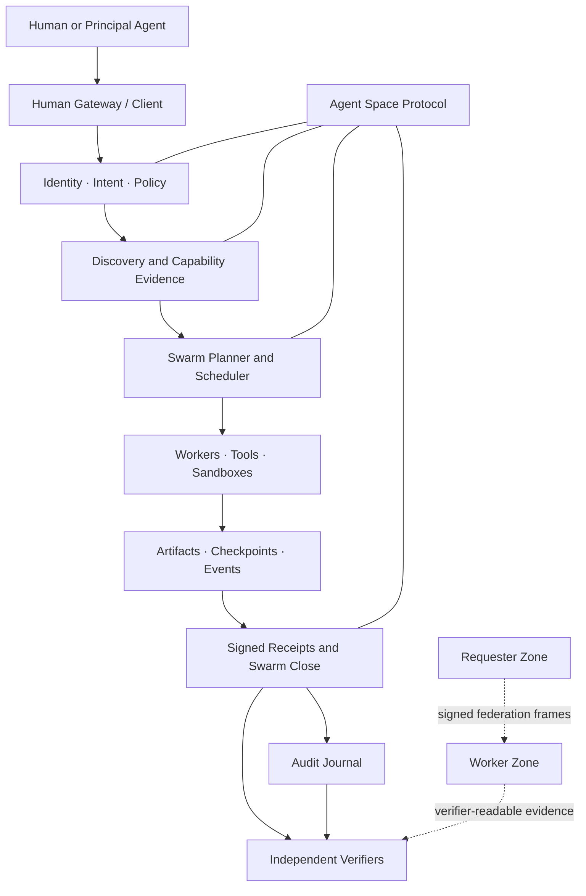
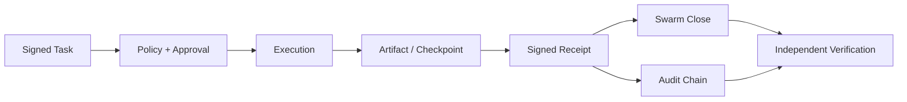

<div align="center">

# Agnet

### Verifiable infrastructure for agent work

**Agent identity · Signed tasks · Durable Swarms · Portable evidence**

[](#current-product-surface)
[](docs/v14-roadmap.md)
[](#system-architecture)
[](go.mod)
[](#license)

Agnet is an implementation-backed research project for the **Agent Space Protocol (ASP)**: a portable proof layer that makes agent work discoverable, authorized, inspectable, and independently verifiable.

[Quick start](#quick-start) · [Architecture](docs/manual/architecture.md) · [Protocol](docs/manual/protocol.md) · [Current status](docs/implementation-status.md) · [Ultimate vision](docs/agent-space-ultimate-vision.md)

</div>

---

## Product thesis

Agent systems can already call tools and coordinate work. What they usually cannot do is prove—across runtimes and organizational boundaries—**who requested an action, what policy authorized it, what actually ran, which bytes were produced, and whether the result should be trusted**.

Agnet treats that missing accountability layer as a protocol problem.

ASP introduces a narrow waist for agent work:

```text
Agent identity
+ Signed task
+ Event stream
+ Scoped policy
+ Artifact reference
+ Audit receipt
+ Federation evidence
```

The runtime remains free to schedule, route, or execute however it wants. The evidence does not. Tasks, receipts, artifacts, checkpoints, approvals, and Swarm closure records are signed, replayable, and verifier-readable outside the runtime that created them.

### What this enables

- **Portable trust** — verify work without trusting the original process or UI.
- **Accountable delegation** — bind intent, requester, worker, policy, and output into one evidence chain.
- **Recoverable agent work** — preserve events, checkpoints, artifacts, leases, and retry lineage.
- **Federated operation** — cross Zone boundaries with explicit identity and trust provenance.
- **Research without hand-waving** — turn claims about agent coordination into executable protocol fixtures and failure tests.

## System architecture

Agnet separates product surfaces from evidence authority. Go owns the durable local runtime and gateway. Node.js owns compact protocol construction and pure verification. Shared vectors keep both implementations aligned.



### Product surfaces

| Surface | Role | Primary implementation |
| --- | --- | --- |
| **ASP Core** | Canonical identities, tasks, receipts, artifacts, discovery, Swarm, knowledge, and trust objects | `asp-core.mjs` |
| **Verifier CLI** | Replays signature, Zone trust, task binding, artifact closure, sandbox, and package proof checks | `asp-verify.mjs` |
| **Federation reference** | Compact Node.js execution and federation behavior | `federation-gateway.mjs` |
| **Durable runtime** | TCP/TLS gateway, queueing, approvals, artifacts, Human Gateway, and journal-backed local Swarms | `cmd/go-fed-discovery/` |
| **TypeScript client SDK** | Authenticated Product API tasks, cursor-resumable events, local receipt trust/signature/task/artifact verification | `agnet/client` |
| **Packaged daemon** | Thin Node launcher plus OS/CPU-specific native daemon packages for Darwin and Linux | `agnet-daemon.mjs`, `@agnet-ai/daemon-*` |
| **Reusable Go verification** | Receipt and Swarm output verification without the gateway | `verifier/` |
| **Interop evidence** | Fixed Node/Go protocol fixtures and adversarial cases | `test-vectors/`, `test/` |

## Current product surface

> **Current baseline:** `v14.11-phase-c-local-foundations`
> **Maturity:** research prototype with a completed local proof kernel—not a production Agent Net.
> **Package line:** `0.1.0-dev.7` prerelease; the Human Gateway requires a bearer token whenever its port is enabled.

U1–U30 are complete for the scoped local foundation. The strongest implemented product slice is a same-host, durable Go Swarm backed by an authoritative filesystem journal and OS process locks.

| Layer | Current state | What is real today | Next boundary |
| --- | --- | --- | --- |
| **Identity & Trust** | Implemented locally | `aid:` identities, Zone descriptors, credentials, revocation, policy evidence, signed sandbox claims | Production key lifecycle and hardware-backed attestation |
| **Task Fabric** | Implemented locally | Signed tasks, events, receipts, artifacts, checkpoints, audit chain, queue/resume evidence | Durable remote artifact transport and multi-host recovery |
| **Discovery** | Implemented locally | `FED_RESOLVE`, evidence-first `FED_QUERY`, capability credentials, trust provenance, labelled routing/reputation signals | Distributed freshness, abuse controls, and interoperable reputation |
| **Swarm** | Durable same-host kernel complete | Journal authority, leases/fencing, deterministic parallel ready waves, receipt commitment, byte-stable close, output gate, signed disband | Cross-host membership, consensus, and worker lifecycle |
| **Isolation** | Proof-backed local slice | Local sandbox evidence and Darwin private-workspace proof | Real container/VM/TEE isolation parity |
| **Knowledge** | Protocol seam complete | Signed query/response frames with source, freshness, license, and query binding | Ingestion, citation/conflict graph, index, and operational gateway |
| **Human product** | Thin operational surface | Human Gateway for tasks, queue, approvals, audit, artifacts, transcripts, and security posture | Organization identity, intent workspace, explainability, and governed UX |
| **Economy & Operations** | Research surface | Micro-contract fields, cost/risk signals, and auditable work evidence | Metering, quotas, SLA, disputes, observability, and recovery operations |

The current architectural coverage is estimated at **55–65% of the Ultimate vision**. That number is an inference about layer coverage, not a production-readiness score. See [Implementation Status](docs/implementation-status.md) for the evidence matrix.

## Proof model

Agnet distinguishes **execution** from **commitment**:

- Worker execution is **at least once** and may repeat after failure.
- A fenced, signed receipt commitment becomes authoritative **once**.
- Completed, failed, and cancelled receipts bind the original signed task; cancellation also carries a separate cancel digest.
- `receipt.committed` is exposed only after durable task state and queue projections agree, and no later per-task events are emitted.
- Artifacts are accepted only when their manifest and bytes match the signed evidence.
- Views are rebuildable; journals, signed records, and content-addressed bytes remain authoritative.
- Independent verifiers replay trust and integrity checks without trusting the scheduler.



A typical federated flow:

1. A requester signs a task with an Ed25519-backed `aid:` identity.
2. `FED_TASK_OPEN` carries the task, requester descriptor, origin Zone, and Zone binding.
3. The worker verifies identity, Zone trust, policy, task shape, and signature before execution.
4. Execution emits events, artifacts, optional checkpoints and approvals, then a worker-signed receipt.
5. `FED_RECEIPT` returns the result with task and artifact bindings.
6. Swarm completion binds step receipts into a Zone-signed `FED_SWARM_CLOSE`.
7. Node and Go verifiers independently replay the evidence chain.

## Quick start

### Run the local proof demo

```bash
bash scripts/proof-demo.sh
```

The demo emits verifier-ready task, receipt, trust, and artifact evidence under `state/`.

Verify the receipt and artifact bytes independently:

```bash
node asp-verify.mjs fed-receipt-artifacts \
  state/proof-demo-fed-receipt.json \
  state/proof-demo-trusted-zones.json
```

### Run the focused verification gates

```bash
node --test --test-concurrency=1 test/*.test.mjs
go test ./...
```

For gateway setup, TLS/mTLS, Human Gateway flows, and verifier commands, use the [manuals](#documentation).

## Research boundary

Agnet is deliberately explicit about what its evidence proves.

### Proven in the current repository

- Cryptographic Agent and Zone identity primitives
- Signed task, receipt, artifact, checkpoint, and audit evidence
- Node/Go interoperability through fixed vectors
- Evidence-first capability discovery and routing signals
- Same-host durable Swarm recovery and deterministic ready-wave execution
- Fenced receipt commitment, stable close, output verification, and signed disband
- Local sandbox claims, signed attestation verification, and Darwin workspace isolation proof
- Human approval and task/audit/artifact inspection surfaces

### Not claimed

- A production security boundary or globally operated Agent Net
- Cross-host durable Swarm execution or remote artifact recovery
- Public P2P/DHT routing, NAT traversal, relay infrastructure, or global discovery
- Hardware remote attestation, VM isolation, or TEE proof
- Exactly-once worker execution or exactly-once external side effects
- Public reputation, marketplace, payment, token, settlement, or insurance systems
- A complete Semantic OS, operational Knowledge Network, or production control plane

These are roadmap boundaries, not hidden fallbacks. The project favors narrow, testable claims over broad demos that cannot be independently verified.

## Roadmap

```text
NOW
  Local proof kernel
  └─ signed work + durable same-host Swarm + independent verification

NEXT
  Private Agent Space
  └─ private multi-host fabric + consensus + trust + knowledge + governance + operations

LATER
  Public Agent Net
  └─ public overlay + open discovery + Sybil resistance + external settlement + ecosystem
```

The long-term direction is documented in [Agent Space Ultimate Vision](docs/agent-space-ultimate-vision.md). The active protocol line is tracked in the [v14 roadmap](docs/v14-roadmap.md). Detailed milestone history belongs in the [changelog](docs/CHANGELOG.md), not in this README.

## Documentation

| Document | Purpose |
| --- | --- |
| [Architecture](docs/manual/architecture.md) | Layer model, proof flow, Node/Go ownership, and current boundaries |
| [Protocol](docs/manual/protocol.md) | ASP frames and protocol behavior |
| [Verifier CLI](docs/manual/verifier-cli.md) | Independent verification commands and failure modes |
| [Federation](docs/manual/federation.md) | Gateway, trusted Zones, TLS/mTLS, and cross-Zone operation |
| [Trust model](docs/manual/trust-model.md) | Identity, credentials, revocation, sandbox, and attestation |
| [Implementation Status](docs/implementation-status.md) | Current evidence matrix and missing exit conditions |
| [v14 Roadmap](docs/v14-roadmap.md) | Active protocol milestone |
| [Ultimate Vision](docs/agent-space-ultimate-vision.md) | Research thesis and long-term Agent Space model |
| [Changelog](docs/CHANGELOG.md) | Historical releases and completed boundaries |
| [Development](docs/manual/development.md) | Tests, Go build, and contribution workflow |

## Repository map

```text
asp-core.mjs                 ASP protocol primitives
asp-verify.mjs               Independent Node.js verifier CLI
federation-gateway.mjs       Node.js federation reference
cmd/go-fed-discovery/        Durable Go gateway and local Swarm runtime
verifier/                    Reusable Go verification packages
test-vectors/                Cross-language protocol fixtures
test/                        Node.js protocol and documentation tests
docs/manual/                 Operator and protocol manuals
scripts/                     Reproducible proof workflows
```

## Contributing

Start with [CONTRIBUTING.md](CONTRIBUTING.md) and [Development](docs/manual/development.md). Protocol changes should include exact failure semantics, cross-language vectors where applicable, and verifier-first tests.

## License

No open-source license has been selected. Until a license is added, default copyright rules apply; repository access does not imply permission to reuse, redistribute, or publish the code.
