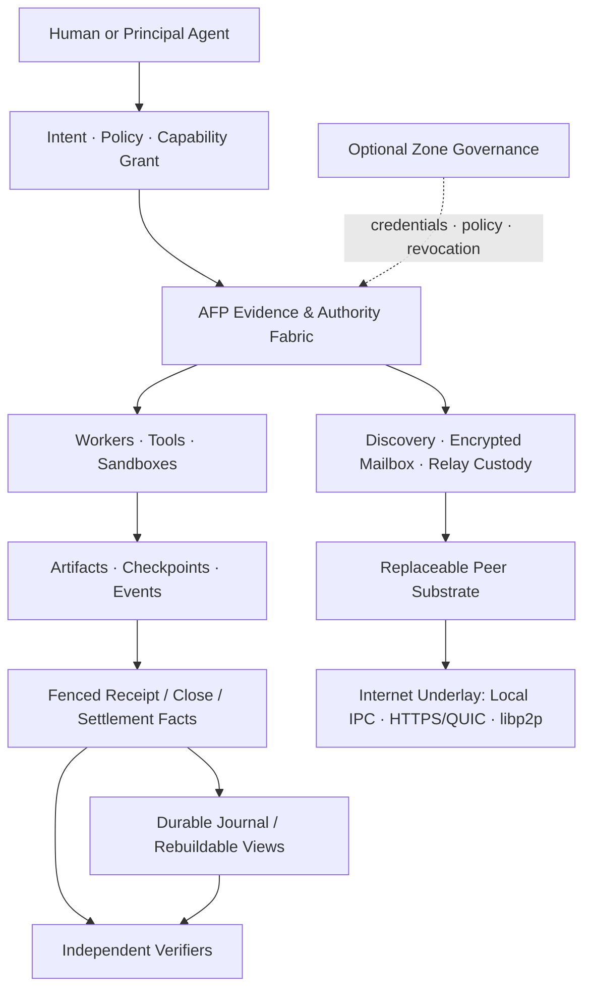
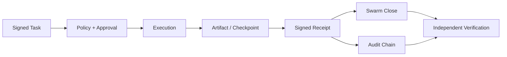

<div align="center">

# Agnet

### Sovereign, verifiable coordination and settlement for the Agent Internet

**Self-sovereign identity · Capability-bound work · Durable evidence · Optional settlement**

[](#current-product-surface)
[](docs/manual/protocol.md)
[](docs/afp-v1-design.md)
[](#system-architecture)
[](go.mod)
[](#license)

Agnet is an implementation-backed research project for the **Agnet Fabric Protocol (AFP)**: a future transport-neutral fabric for sovereign Agent coordination, verifiable work, and programmable settlement. Its current implementation is **ASP v14**, a local-first proof kernel whose signed task, event, artifact, checkpoint, receipt, and Swarm semantics become AFP's evidence narrow waist.

**ASP v14 remains the implemented local-first wire surface.** AFP v1 does not silently rename or reinterpret existing frames, vectors, artifact fields, CLIs, or package APIs.

[Quick start](#quick-start) · [AFP v1 design](docs/afp-v1-design.md) · [Architecture](docs/manual/architecture.md) · [Current wire protocol](docs/manual/protocol.md) · [Current status](docs/implementation-status.md) · [Ultimate vision](docs/agent-space-ultimate-vision.md)

</div>

---

## Product thesis

Agent systems can call tools and coordinate work, but they usually cannot prove—across runtimes, endpoints, relays, and organizations—**who authorized an action, which bounded capability was used, what actually ran, which bytes were produced, which party accepted custody, and whether a result or charge should be trusted**.

Agnet treats that accountability gap as an Agent Internet fabric problem, not as an HTTP API problem.

AFP defines the future narrow waist for agent work:

```text
Self-sovereign Agent identity
+ Capability grant and policy
+ Signed task and causal events
+ Context-bound Artifact reference
+ Fenced receipt commitment
+ Optional custody and settlement commitment
```

The transport, relay, discovery provider, storage provider, scheduler, and payment rail remain replaceable. The authority and evidence do not. The current ASP v14 runtime already proves the local core: signed tasks, receipts, artifacts, checkpoints, approvals, and Swarm closure records are replayable and verifier-readable outside the runtime that created them.

### What this enables

- **Portable trust** — verify work without trusting the original process or UI.
- **Accountable delegation** — bind intent, requester, worker, policy, and output into one evidence chain.
- **Recoverable agent work** — preserve events, checkpoints, artifacts, leases, and retry lineage.
- **Federated operation** — cross Zone boundaries with explicit identity and trust provenance.
- **Research without hand-waving** — turn claims about agent coordination into executable protocol fixtures and failure tests.

## System architecture

Agnet separates product surfaces, Agent-level authority, and byte transport. Go owns the durable local runtime and gateway. Node.js owns compact protocol construction and pure verification. Shared vectors keep both implementations aligned.



**Current boundary:** only the local ASP v14 proof kernel is implemented. AFP's sovereign delivery, public discovery, relay custody, P2P substrate, and settlement adapters are planned, not claimed.

### Product surfaces

| Surface | Role | Primary implementation |
| --- | --- | --- |
| **AFP v1 design** | Target transport-neutral identity, authority, delivery, evidence, and settlement contract | `docs/afp-v1-design.md` |
| **ASP v14 proof core** | Implemented local-first identities, tasks, receipts, artifacts, discovery, Swarm, knowledge, and trust objects | `asp-core.mjs` |
| **Verifier CLI** | Replays signature, Zone trust, task binding, artifact closure, sandbox, and package proof checks | `asp-verify.mjs` |
| **Federation reference** | Compact Node.js execution and governed federation behavior | `federation-gateway.mjs` |
| **Durable runtime** | TCP/TLS gateway, queueing, approvals, artifacts, Human Gateway, and journal-backed local Swarms | `cmd/go-fed-discovery/` |
| **TypeScript client SDK** | Authenticated Product API tasks, cursor-resumable events, local receipt trust/signature/task/artifact verification | `agnet/client` |
| **Packaged daemon** | Thin Node launcher plus OS/CPU-specific native daemon packages for Darwin and Linux | `agnet-daemon.mjs`, `@agnet-ai/daemon-*` |
| **Reusable Go verification** | Receipt and Swarm output verification without the gateway | `verifier/` |
| **Interop evidence** | Fixed Node/Go protocol fixtures and adversarial cases | `test-vectors/`, `test/` |

## Current product surface

> **Current baseline:** `v14.11-phase-c-local-foundations`
> **Maturity:** research prototype with a completed local proof kernel—not a production Agent Internet.
> **Protocol status:** ASP v14 is implemented locally; AFP v1 is a strategic design gate, not a released wire protocol.
> **Package line:** `0.1.0-dev.7` prerelease; the Human Gateway requires a bearer token whenever its port is enabled.

U1–U30 are complete for the scoped local foundation. The strongest implemented slice is a same-host durable Go Swarm backed by an authoritative filesystem journal and OS process locks. These semantics are the evidence base AFP reuses; they do not yet prove endpoint-independent Agent delivery or public operation.

| Layer | Current state | What is real today | Next boundary |
| --- | --- | --- | --- |
| **Identity & Trust** | Implemented locally | `aid:` identities, Zone descriptors, credentials, revocation, policy evidence, signed sandbox claims | AFP sovereign descriptor, capability grants, production key lifecycle, and hardware-backed attestation |
| **Task Fabric** | Implemented locally | Signed tasks, events, receipts, artifacts, checkpoints, audit chain, queue/resume evidence | Direct remote task semantics, encrypted delivery, durable remote artifacts, and multi-host recovery |
| **Discovery** | Implemented locally | `FED_RESOLVE`, evidence-first `FED_QUERY`, capability credentials, trust provenance, labelled routing/reputation signals | Privacy-bounded capability queries, signed offers, freshness propagation, and abuse controls |
| **Swarm** | Durable same-host kernel complete | Journal authority, leases/fencing, deterministic parallel ready waves, receipt commitment, byte-stable close, output gate, signed disband | Task-scoped Direct Swarm and governed cross-host authority |
| **Delivery & Overlay** | Local proof only | Local TCP/TLS/WebSocket paths and scoped reachability evidence | Endpoint-independent encrypted mailbox, relay custody, direct/relayed reachability, and reusable P2P substrate |
| **Isolation** | Proof-backed local slice | Local sandbox evidence and Darwin private-workspace proof | Capability-bound sandbox handshake and real container/VM/TEE isolation parity |
| **Knowledge** | Protocol seam complete | Signed query/response frames with source, freshness, license, and query binding | Ingestion, citation/conflict graph, index, and operational gateway |
| **Human product** | Thin operational surface | Human Gateway for tasks, queue, approvals, audit, artifacts, transcripts, and security posture | Principal intent workspace with explicit direct/relayed/governed assurance |
| **Economy & Operations** | Research surface | Micro-contract fields, cost/risk signals, and auditable work evidence | Metering, budget reservation, settlement adapters, disputes, observability, and recovery operations |

The current architectural coverage is estimated at **55–65% of the Ultimate vision**. That number is an inference about layer coverage, not a production-readiness score. See [Implementation Status](docs/implementation-status.md) for the evidence matrix.

## Proof model

Agnet distinguishes **execution** from **commitment**:

- Worker execution is **at least once** and may repeat after failure.
- A fenced, signed receipt commitment becomes authoritative **once**.
- Completed, failed, and cancelled receipts bind the original signed task; cancellation also carries a separate cancel digest.
- `receipt.committed` is exposed only after durable task state and queue projections agree, and no later per-task events are emitted.
- Artifacts are accepted only when their manifest and bytes match the signed evidence.
- Views are rebuildable; journals, signed records, and content-addressed bytes remain authoritative.
- Independent verifiers replay trust and integrity checks without trusting the scheduler.



A typical federated flow:

1. A requester signs a task with an Ed25519-backed `aid:` identity.
2. `FED_TASK_OPEN` carries the task, requester descriptor, origin Zone, and Zone binding.
3. The worker verifies identity, Zone trust, policy, task shape, and signature before execution.
4. Execution emits events, artifacts, optional checkpoints and approvals, then a worker-signed receipt.
5. `FED_RECEIPT` returns the result with task and artifact bindings.
6. Swarm completion binds step receipts into a Zone-signed `FED_SWARM_CLOSE`.
7. Node and Go verifiers independently replay the evidence chain.

## Quick start

### Run the local proof demo

```bash
bash scripts/proof-demo.sh
```

The demo emits verifier-ready task, receipt, trust, and artifact evidence under `state/`.

Verify the receipt and artifact bytes independently:

```bash
node asp-verify.mjs fed-receipt-artifacts \
  state/proof-demo-fed-receipt.json \
  state/proof-demo-trusted-zones.json
```

### Run the focused verification gates

```bash
node --test --test-concurrency=1 test/*.test.mjs
go test ./...
```

For gateway setup, TLS/mTLS, Human Gateway flows, and verifier commands, use the [manuals](#documentation).

## Research boundary

Agnet is deliberately explicit about what its evidence proves.

### Proven in the current repository

- Cryptographic Agent and Zone identity primitives
- Signed task, receipt, artifact, checkpoint, and audit evidence
- Node/Go interoperability through fixed vectors
- Evidence-first capability discovery and routing signals
- Same-host durable Swarm recovery and deterministic ready-wave execution
- Fenced receipt commitment, stable close, output verification, and signed disband
- Local sandbox claims, signed attestation verification, and Darwin workspace isolation proof
- Human approval and task/audit/artifact inspection surfaces

### Designed but not implemented

- AFP v1's transport-neutral envelope and compatibility vectors
- Sovereign Direct tasks between independent remote operators
- Attenuated capability grants and capability-bound sandbox handshakes
- Encrypted endpoint-independent mailboxes, relay custody, and store-and-forward ordering
- Public P2P/DHT discovery, anti-abuse, and signed offer exchange
- Settlement adapters for verified delivery, storage, execution, and verification commitments

### Not claimed

- A production security boundary or globally operated Agent Internet
- Cross-host durable Swarm execution or remote artifact recovery
- Public P2P/DHT routing, NAT traversal, relay infrastructure, or global discovery
- Hardware remote attestation, VM isolation, or TEE proof
- Exactly-once worker execution or exactly-once external side effects
- A mandatory blockchain, token, marketplace, payment rail, or globally trusted reputation system
- A complete Semantic OS, operational Knowledge Network, or production control plane

These are roadmap boundaries, not hidden fallbacks. The project favors narrow, testable claims over broad demos that cannot be independently verified.

## Roadmap

```text
NOW
  U1–U30 local proof kernel
  └─ signed work + durable same-host Swarm + independent verification

NEXT: AFP FOUNDATION
  AF0 protocol freeze → AF1 sovereign invited Direct work → AF2 async mailbox custody

THEN: SOVEREIGN AGENT INTERNET
  AF3 P2P reachability → AF4 capability query/offers → AF5 Direct Swarm

IN PARALLEL: GOVERNED / PRIVATE PROFILE
  U31–U68 private cluster, remote fabric, consensus, governance, knowledge, and operations

LATER: ECONOMY AND PRODUCT CONVERGENCE
  AF6 settlement adapters → AF7 unified assurance-aware product surface
```

The full target is documented in the [AFP v1 design](docs/afp-v1-design.md) and [Agent Space Ultimate Vision](docs/agent-space-ultimate-vision.md). The active implemented protocol line is tracked in the [v14 roadmap](docs/v14-roadmap.md). Detailed milestone history belongs in the [changelog](docs/CHANGELOG.md), not in this README.

## Documentation

| Document | Purpose |
| --- | --- |
| [AFP v1 Design](docs/afp-v1-design.md) | Canonical Web3-native positioning, AFP boundaries, object families, and ordered programs |
| [Architecture](docs/manual/architecture.md) | Current/target layer model, proof flow, Node/Go ownership, and boundary rules |
| [Protocol](docs/manual/protocol.md) | Implemented ASP v14 frames and their AFP migration boundary |
| [Verifier CLI](docs/manual/verifier-cli.md) | Independent verification commands and failure modes |
| [Federation](docs/manual/federation.md) | Current governed gateway, trusted Zones, TLS/mTLS, and cross-Zone operation |
| [Trust model](docs/manual/trust-model.md) | Identity, credentials, revocation, sandbox, and attestation |
| [Implementation Status](docs/implementation-status.md) | Current evidence matrix and missing exit conditions |
| [Ultimate Vision](docs/agent-space-ultimate-vision.md) | Long-term Agent Internet model and economic/governance boundaries |
| [Sovereign/Public plan](.compound-engineering/work/2026-07-13-sovereign-public-agent-net-plan.md) | Requirements for the permissionless AFP participation profile |
| [Governed/Private plan](.compound-engineering/work/2026-07-13-private-ultimate-agent-space-plan.md) | U31–U68 hardened private deployment profile |
| [v14 Roadmap](docs/v14-roadmap.md) | Active implemented protocol milestone |
| [Changelog](docs/CHANGELOG.md) | Historical releases and completed boundaries |
| [Development](docs/manual/development.md) | Tests, Go build, and contribution workflow |

## Repository map

```text
docs/afp-v1-design.md        AFP strategic design and protocol boundary
asp-core.mjs                 Implemented ASP v14 protocol primitives
asp-verify.mjs               Independent Node.js verifier CLI
federation-gateway.mjs       Node.js governed federation reference
cmd/go-fed-discovery/        Durable Go gateway and local Swarm runtime
verifier/                    Reusable Go verification packages
test-vectors/                Cross-language protocol fixtures
test/                        Node.js protocol and documentation tests
docs/manual/                 Operator and protocol manuals
scripts/                     Reproducible proof workflows
```

## Contributing

Start with [CONTRIBUTING.md](CONTRIBUTING.md) and [Development](docs/manual/development.md). Protocol changes should include exact failure semantics, cross-language vectors where applicable, and verifier-first tests.

## License

No open-source license has been selected. Until a license is added, default copyright rules apply; repository access does not imply permission to reuse, redistribute, or publish the code.
