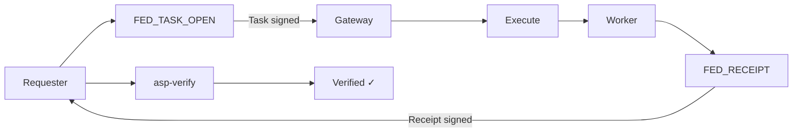

# Agnet — Agent Space Protocol (ASP)

Agnet is the proof layer for agent work.

[](docs/v14-roadmap.md) [](#quick-start) [](go.mod)

Status: research prototype, local-first, v14 active at `v14.8-protocol`. Historical baseline: v14.7 Policy and risk routing signals, v13 active-through `v13.15-protocol`, and v12 closed at `v12.45-protocol`.

v14.8 adds deterministic Swarm conflict resolution: when Swarm steps write the same artifact ref with different SHA-256 digests, close proofs carry signed `conflict_resolutions` choosing the higher agent_score reputation worker with `alias_tiebreak` fallback. It is not voting/quorum, automatic merge of conflicting content, payment/settlement, or a departure from local-first proof.

## What ASP is

Agent Space Protocol (ASP) is the narrow accountability layer for agent task execution. It signs tasks, receipts, artifacts, audit entries, sandbox claims, and federation evidence so another verifier can inspect what happened without trusting the original runtime.

MCP makes tools callable and coordination protocols move work between agents; ASP focuses on the missing proof layer: who requested work, who accepted it, what policy applied, what bytes were produced, and whether the receipt verifies independently.

## Architecture

```text
Human Society
  goals, approvals, governance, legal responsibility

Semantic OS
  personal lead agents, organizational entry points, task boards

Agent Economy
  service markets, reputation, quotas, settlement, liability

Agent Swarm Layer
  dynamic teams, roles, collaboration topology, task DAGs

Trust & Verification Layer
  identity, credentials, sandbox claims, attestation, audit, verification

Agent Task Fabric
  signed tasks, event streams, artifacts, receipts, checkpoints

Agent Discovery Layer
  Agent IDs, capability addressing, semantic recall, reputation ranking

Agent Overlay Network
  Zones, federation, P2P relay, DHT, edge gateways

Internet Underlay
  TCP/IP, QUIC, TLS, WebSocket, HTTP, cloud and edge networks
```

This repository implements proof-layer primitives across Trust & Verification, Agent Task Fabric, Discovery, and local/federated gateway paths. It does not implement the full economy, global overlay network, or production security boundary.

## Proof flow



## Quick start

```bash
bash scripts/proof-demo.sh
node asp-verify.mjs fed-receipt-artifacts state/proof-demo-fed-receipt.json state/proof-demo-trusted-zones.json
node --test --test-concurrency=1 docs-contract.test.mjs
node --test --test-concurrency=1 *.test.mjs
go test ./...
```

## What's new in v14

- Micro-contracts: signed cost, latency, and capability commitments per Swarm step.
- Multi-signal routing: cost, latency, availability, and reputation labels travel with discovery evidence.
- Trust chains: Zone delegation records make cross-zone provenance inspectable.
- Failure migration: failed steps retry once on same-capability replacement workers with signed migration logs.
- Intent decomposition: `FED_SWARM_PLAN` binds generated Swarm plans to a signed `plan_digest`.
- Knowledge Gateway: `FED_KNOWLEDGE_QUERY` and `FED_KNOWLEDGE_RESPONSE` bind cited freshness/license results to a signed query digest.
- Conflict resolution: `FED_SWARM_CLOSE.close.conflict_resolutions` records signed, deterministic same-artifact conflict choices.

## Repo map quicklinks

| Read | For |
| --- | --- |
| [Architecture](docs/manual/architecture.md) | Proof layers, data flow, and how Node/Go pieces relate. |
| [Protocol](docs/manual/protocol.md) | ASP frames: `FED_TASK_OPEN`, `FED_RECEIPT`, `FED_SWARM_*`, `FED_SWARM_PLAN`, discovery, audit, artifacts. |
| [Verifier CLI](docs/manual/verifier-cli.md) | Full `asp-verify.mjs` command syntax and failure modes. |
| [Federation](docs/manual/federation.md) | Gateway setup, trusted Zones, TLS/mTLS, cross-zone usage. |
| [Trust model](docs/manual/trust-model.md) | Identity, credentials, revocation, sandbox proof, attestation. |
| [Reputation](docs/manual/reputation.md) | `agent_score`, routing signals, and discovery evidence. |
| [Development](docs/manual/development.md) | Local tests, Go build, contribution workflow. |
| [Changelog](docs/CHANGELOG.md) | Concise v13.0 through v14.4 history. |

## Roadmap status

| Gate | Status | Evidence | Pending / non-goal |
| --- | --- | --- | --- |
| v13.1 hosted/public reachability | Active / pending exit criterion | Verifier-owned `local-interface`, `container-observer`, and `external-host` scopes; hosted runner exists | A successful real hosted external-host observer run against a globally routable literal-IP listener is still pending. |
| v13.2 release trust/SBOM | Complete | `asp-release-trust/v1`, package proof binding, release signer verification | Not CycloneDX/SPDX/SLSA, not registry signing, not package publish. |
| v13.3 strong sandbox / remote attestation | Active / partially complete | Local-process sandbox proof and signed sandbox attestation verifier | Hardware remote attestation and real container/VM/TEE isolation remain unimplemented and fail closed. |
| v13.4-v13.15 discovery, scheduling, checkpoints | Complete for current local evidence surface | Semantic discovery, Go parity, audit-backed receipt counts, credential expiry, revocation, labelled `agent_score`, receipt checkpoint verification | No global reputation graph, marketplace, remote feed, or scheduler orchestration beyond scoped primitives. |
| v14.1 Swarm micro-contracts | Complete | Node and Go close proofs carry signed worker cost/latency/capability commitments | Not pricing, payment, settlement, or SLA enforcement. |
| v14.2 multi-signal routing | Complete | `discovery_evidence.routing` with cost, latency, availability, and `signals_used` | Not opaque ML routing or remote reputation scoring. |
| v14.3 cross-zone trust chains | Complete | Signed Zone delegation records and `zone_trust_chain` discovery provenance | Not global PKI, DID-native universal resolution, or universal trust. |
| v14.4 Task failure migration | Complete | Node and Go Swarm execution can migrate a failed step with signed `migration_log` close evidence | Not invisible retries, model KV restore, or distributed scheduling. |
| v14.5 Intent Decomposition | Complete | `swarmPlan`, `FED_SWARM_PLAN`, and `plan_digest` evidence are documented in `docs/v14.5-boundary.md` | Not LLM orchestration, automatic candidate selection, or full DAG execution. |
| v14.6 Knowledge Gateway proto | Complete | `knowledgeQuery`, `FED_KNOWLEDGE_QUERY`, `FED_KNOWLEDGE_RESPONSE`, and `verifyKnowledgeResponse` are documented in `docs/v14.6-boundary.md` | Not a web crawler, semantic cache, vector store, or RAG pipeline. |
| v14.7 policy/risk routing signals | Complete | `discovery_evidence.routing.policy_match` and `risk_match` feed labelled `agent_score` and `ranking.reasons` evidence | Not a new trust oracle, policy language, marketplace ranker, or opaque ML router. |
| v14.8 Swarm conflict resolution | Complete | `conflict_resolutions` entries bind artifact ref, candidate steps, chosen worker, reason, digest, and Zone signature | Not voting/quorum, automatic content merge, payment/settlement, or non-local-first arbitration. |

## Non-claims

- Agnet is not a production security boundary, public Agent Net, P2P DHT, NAT traversal layer, token economy, or public marketplace.
- `aid:` Ed25519 identity is canonical here; `did:key` is only a bridge field, not DID document resolution or DID service routing.
- Local-process sandbox proof and signed attestation evidence are not hardware remote attestation, container namespace isolation, VM isolation, or TEE proof.

## Protocol reference index

Detailed milestone history lives in the roadmap and boundary docs; this README keeps the public filenames discoverable without embedding the old long-form changelog. v9 and v10 are closed.

- Roadmaps:
  `docs/v10-roadmap.md` - closed v10 roadmap. `docs/v11-roadmap.md` - closed v11 roadmap. `docs/v12-roadmap.md` - closed v12 roadmap. `docs/v13-roadmap.md` - closed v13 roadmap.
  `docs/v14-roadmap.md` - active v14 roadmap.
- v11 boundaries:
  `docs/v11.3-boundary.md` - task id token validation boundary. `docs/v11.4-boundary.md` - receipt task digest binding boundary. `docs/v11.5-boundary.md` - optional receipt task evidence verification boundary. `docs/v11.6-boundary.md` - artifact closure task evidence parity boundary.
  `docs/v11.7-boundary.md` - Go receipt CLI task evidence boundary. `docs/v11.8-boundary.md` - Go-to-Node interop receipt task binding boundary. `docs/v11.9-boundary.md` - Node-to-Go interop receipt task binding boundary. `docs/v11.10-boundary.md` - FED_RECEIPT frame type validation boundary.
  `docs/v11.11-boundary.md` - FED_TASK_OPEN frame type validation boundary. `docs/v11.12-boundary.md` - FED_SWARM_CLOSE duplicate step validation boundary. `docs/v11.13-boundary.md` - FED_SWARM_CLOSE Swarm identity presence boundary. `docs/v11.14-boundary.md` - FED_SWARM_CLOSE NUL identity validation boundary.
  `docs/v11.15-boundary.md` - FED_SWARM_CLOSE step task id validation boundary. `docs/v11.16-boundary.md` - FED_SWARM_CLOSE close signature presence boundary. `docs/v11.17-boundary.md` - FED_SWARM_CLOSE close proof presence boundary. `docs/v11.18-boundary.md` - FED_SWARM_CLOSE signing Zone presence boundary.
  `docs/v11.19-boundary.md` - FED_SWARM_CLOSE step receipt object presence boundary. `docs/v11.20-boundary.md` - FED_SWARM_CLOSE frame object presence boundary. `docs/v11.21-boundary.md` - FED_TASK_OPEN and FED_RECEIPT frame object presence boundary. `docs/v11.22-boundary.md` - FED_TASK_OPEN and FED_RECEIPT Zone descriptor presence boundary.
  `docs/v11.23-boundary.md` - FED_TASK_OPEN and FED_RECEIPT payload object presence boundary. `docs/v11.24-boundary.md` - Node trusted Zone store presence boundary. `docs/v11.25-boundary.md` - FED_TASK_OPEN worker context presence boundary. `docs/v11.26-boundary.md` - FED_TASK_OPEN and FED_RECEIPT signature presence boundary.
  `docs/v11.27-boundary.md` - FED_TASK_OPEN worker descriptor identity boundary. `docs/v11.28-boundary.md` - FED_RECEIPT worker descriptor identity boundary. `docs/v11.29-boundary.md` - Node descriptor public key presence boundary. `docs/v11.31-boundary.md` - Node Zone descriptor object presence boundary.
  `docs/v11.32-boundary.md` - Node did:key input presence boundary. `docs/v11.33-boundary.md` - Node artifact manifest object presence boundary. `docs/v11.34-boundary.md` - Node credential object presence boundary. `docs/v11.35-boundary.md` - Node rotation proof object presence boundary.
  `docs/v11.36-boundary.md` - Node Zone binding object presence boundary. `docs/v11.37-boundary.md` - Node Zone revocation object presence boundary. `docs/v11.38-boundary.md` - Node trusted Zone file shape boundary. `docs/v11.39-boundary.md` - Node registry file shape boundary.
  `docs/v11.40-boundary.md` - Node resolveAgent registry context boundary. `docs/v11.41-boundary.md` - Node descriptor body object presence boundary. `docs/v11.42-boundary.md` - Node proof verifier malformed descriptor fail-closed boundary. `docs/v11.43-boundary.md` - Node local artifact URI boundary.
  `docs/v11.44-boundary.md` - Node local artifact path boundary. `docs/v11.45-boundary.md` - Go artifact digest path boundary. `docs/v11.46-boundary.md` - receipt artifact digest shape boundary. `docs/v11.47-boundary.md` - receipt artifact size shape boundary.
  `docs/v11.48-boundary.md` - Go artifact media type shape boundary. `docs/v11.49-boundary.md` - Go artifact manifest hash shape boundary. `docs/v11.50-boundary.md` - Go artifact list shape boundary. `docs/v11.51-boundary.md` - Go artifact mirror index shape boundary.
  `docs/v11.52-boundary.md` - Go artifact mirror index entry boundary. `docs/v11.53-boundary.md` - Go artifact mirror index digest boundary. `docs/v11.54-boundary.md` - Go artifact mirror index digest presence boundary. `docs/v11.55-boundary.md` - Go artifact mirror index manifest hash boundary.
  `docs/v11.56-boundary.md` - Go artifact mirror index AFP boundary. `docs/v11.57-boundary.md` - Go artifact mirror index size boundary. `docs/v11.58-boundary.md` - Go artifact mirror index media type boundary. `docs/v11.59-boundary.md` - Go artifact mirror index URI boundary.
  `docs/v11.60-boundary.md` - Go artifact manifest URI boundary. `docs/v11.61-boundary.md` - Go artifact manifest AFP boundary. `docs/v11.62-boundary.md` - Go artifact mirror index AFP type boundary. `docs/v11.63-boundary.md` - Go Swarm dependency list shape boundary.
  `docs/v11.64-boundary.md` - Go Swarm close step list shape boundary. `docs/v11.65-boundary.md` - Go receipt approval list shape boundary. `docs/v11.66-boundary.md` - Go receipt checkpoint list shape boundary. `docs/v11.67-boundary.md` - Go runtime checkpoint lookup list shape boundary.
  `docs/v11.68-boundary.md` - Go receipt artifact lookup list shape boundary. `docs/v11.69-boundary.md` - Go FED_SWARM_OPEN after list shape boundary. `docs/v11.70-boundary.md` - Go queue grant scope list shape boundary. `docs/v11.71-boundary.md` - Go task write scope list shape boundary.
  `docs/v11.72-boundary.md` - Go task data domains list shape boundary. `docs/v11.73-boundary.md` - Go worker approval required list shape boundary. `docs/v11.74-boundary.md` - Go receipt policy scope list shape boundary. `docs/v11.75-boundary.md` - Go receipt policy scope scalar shape boundary.
  `docs/v11.76-boundary.md` - Go receipt task id token boundary. `docs/v11.77-boundary.md` - Node receipt task id token boundary. `docs/v11.78-boundary.md` - Node receipt artifact URI/ref shape boundary. `docs/v11.79-boundary.md` - public transport receipt proof boundary.
- v12 boundaries:
  `docs/v12.0-boundary.md` - public proof bundle manifest boundary. `docs/v12.1-boundary.md` - proof bundle verifier command boundary. `docs/v12.2-boundary.md` - public proof summary bundle verification boundary. `docs/v12.3-boundary.md` - bundle-relative proof file paths boundary.
  `docs/v12.4-boundary.md` - proof bundle path safety boundary. `docs/v12.5-boundary.md` - proof bundle type gate boundary. `docs/v12.6-boundary.md` - proof bundle manifest object boundary. `docs/v12.7-boundary.md` - proof bundle path preflight boundary.
  `docs/v12.8-boundary.md` - proof bundle CLI arity boundary. `docs/v12.9-boundary.md` - proof bundle exact CLI arity boundary. `docs/v12.10-boundary.md` - verifier CLI exact arity boundary. `docs/v12.11-boundary.md` - proof bundle public transport gate boundary.
  `docs/v12.12-boundary.md` - proof bundle transport proof shape boundary. `docs/v12.13-boundary.md` - proof bundle federation transport gate boundary. `docs/v12.14-boundary.md` - proof bundle listen host gate boundary. `docs/v12.15-boundary.md` - proof bundle unspecified host gate boundary.
  `docs/v12.16-boundary.md` - proof bundle reachability scope boundary. `docs/v12.17-boundary.md` - proof bundle reachability scope ownership boundary. `docs/v12.18-boundary.md` - package artifact proof boundary. `docs/v12.19-boundary.md` - package artifact SHA-256 boundary.
  `docs/v12.20-boundary.md` - package proof manifest boundary. `docs/v12.21-boundary.md` - package proof digest boundary. `docs/v12.22-boundary.md` - package proof verifier command boundary. `docs/v12.23-boundary.md` - package proof manifest object boundary.
  `docs/v12.24-boundary.md` - package proof tarball path safety boundary. `docs/v12.25-boundary.md` - package proof manifest-relative tarball boundary. `docs/v12.26-boundary.md` - package proof npm digest verification boundary. `docs/v12.27-boundary.md` - package proof verified metadata output boundary.
  `docs/v12.28-boundary.md` - package proof filename binding boundary. `docs/v12.29-boundary.md` - package proof file list shape boundary. `docs/v12.30-boundary.md` - package proof manifest filename binding boundary. `docs/v12.31-boundary.md` - package proof identity filename binding boundary.
  `docs/v12.32-boundary.md` - Go canonical JSON HTML escape parity boundary. `docs/v12.33-boundary.md` - external reachability evidence gate boundary. `docs/v12.34-boundary.md` - external reachability observer boundary. `docs/v12.35-boundary.md` - Docker external reachability observer wrapper boundary.
  `docs/v12.37-boundary.md` - core substrate recenter boundary. `docs/v12.38-boundary.md` - package proof ASP signature boundary. `docs/v12.39-boundary.md` - package proof trusted signer pin boundary. `docs/v12.40-boundary.md` - trusted signer list shape boundary.
  `docs/v12.41-boundary.md` - package proof metadata preflight boundary. `docs/v12.42-boundary.md` - package proof identity shape boundary. `docs/v12.43-boundary.md` - package proof byte metadata shape boundary. `docs/v12.44-boundary.md` - package proof signer capability boundary.
  `docs/v12.45-boundary.md` - latest closed boundary.
- v13 boundaries:
  `docs/v13.0-boundary.md` - v13 opening boundary. `docs/v13.15-boundary.md` - v13.15 Node receipt checkpoint verification boundary. `docs/v13.11-boundary.md` - v13.11 audit-backed receipt-count reputation boundary. `docs/v13.12-boundary.md` - v13.12 credential valid_until expiry boundary.
  `docs/v13.13-boundary.md` - v13.13 authority Zone revocation discovery boundary. `docs/v13.14-boundary.md` - v13.14 multi-signal agent score reputation boundary.
- v14 boundaries:
  `docs/v14.0-boundary.md` - v14 opening boundary. `docs/v14.2-boundary.md` - v14.2 multi-signal FED_QUERY routing boundary. `docs/v14.3-boundary.md` - v14.3 cross-zone trust chain boundary. `docs/v14.4-boundary.md` - v14.4 task failure migration boundary. `docs/v14.8-boundary.md` - v14.8 Swarm conflict resolution boundary.

## Verifier and proof commands

| Command | Verifies |
| --- | --- |
| `asp-verify.mjs fed-receipt` | Signed `FED_RECEIPT` Zone trust, worker identity, and task digest. |
| `asp-verify.mjs fed-receipt-artifacts` | Receipt task binding plus artifact manifest closure and byte digests. |
| `asp-verify.mjs proof-bundle` / `proof-bundle <bundle.json> [external-trusted-zones.json]` | Public-listen gateway proof, transport proof, reachability scope, and bundle-relative proof file paths. |
| `scripts/package-proof.mjs` + `asp-verify.mjs package-proof` | Package proof digest, ASP signature, trusted signer pin, metadata, and package proof tarball path safety. |
| `asp-verify.mjs sandbox-proof <frame.json> <trusted-zones.json> [required-sandbox-class]` | Signed sandbox class, Zone trust, and fail-closed sandbox claim shape. |
| `asp-verify.mjs sandbox-attestation <frame.json> <trusted-zones.json> <attestation.json> <trusted-attestors.json>` | Sandbox attestation signer trust, target frame binding, and attestor allow-list. |
| `scripts/external-reachability-observer.mjs` / `scripts/docker-external-reachability-observer.sh` | External reachability evidence using `AGNET_REACHABILITY_OBSERVER_SEED_HEX`, `AGNET_PUBLIC_LISTEN_HOST`, and `AGNET_PUBLIC_PROOF_KEEPALIVE_MS`. |

## Contributing and license

Read [CONTRIBUTING.md](CONTRIBUTING.md). No open-source license has been selected yet; until a license is added, default copyright rules apply and contributors should not assume reuse rights beyond repository access.
